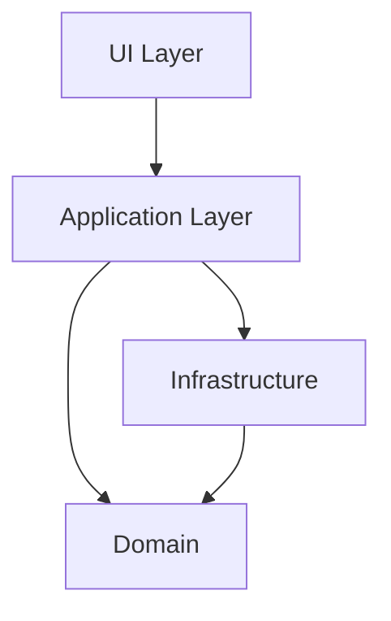
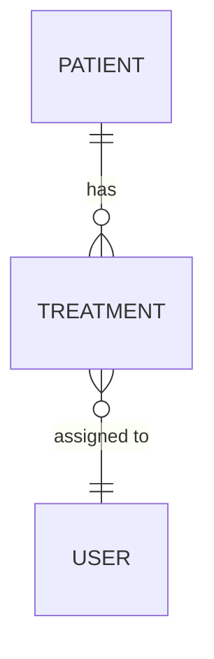
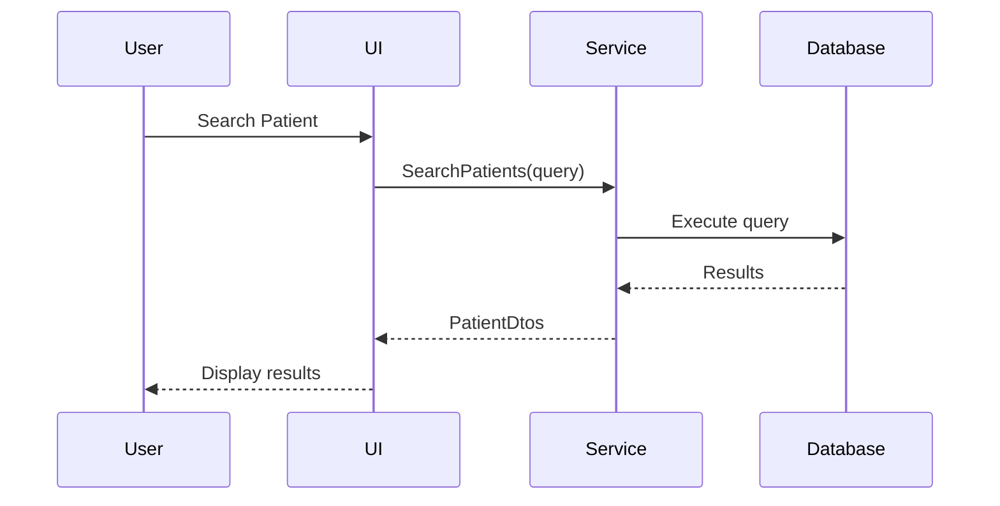
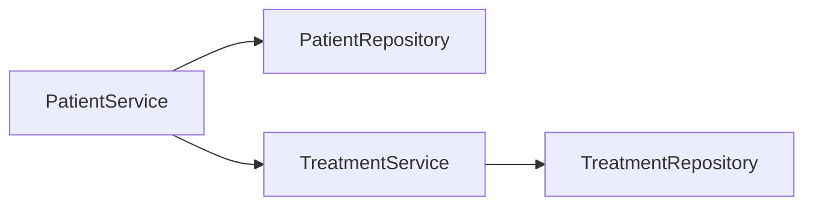

# Master Prompt for System Documentation

> **Purpose**: This document contains the master prompt used to generate or update `docs/system-overview.md`.  
> **Usage**: Use this prompt when creating comprehensive system documentation or when major architectural changes require documentation updates.  
> **Last Updated**: `2025-11-27`

---

## Philosophy

**Documentation should explain WHY the system is built as it is, not catalog every implementation detail.**

- Focus on architectural decisions and trade-offs
- Document flows and interactions, not exact implementations
- Keep concepts stable, let code be the source of truth for details
- Reference code files for specifics (versions, schemas, configurations)

---

## Overview

You are tasked with creating high-level system documentation for **Behandlingsoversikt**.  
Generate or update a `docs/system-overview.md` file that remains stable over time by focusing on architectural concepts rather than implementation details.

---

## Required Sections

### 1. System Overview
- Brief description of the system's purpose and core functionality
- Target users and primary use cases
- Key business value propositions

### 2. Architecture Overview
- High-level architecture diagram (Mermaid)
- Architectural pattern used (Clean Architecture, Onion Architecture, etc.)
- Layer descriptions and responsibilities
- Separation of concerns explanation

### 3. Technology Stack
**Focus on choices and rationale, not versions**
- Core framework and UI technology (e.g., ".NET + Blazor Server")
- Database technology and why
- Authentication approach (Windows Auth, OAuth, etc.)
- Key architectural libraries (ORM, DI container, etc.)
- **Note**: For specific versions, reference `.csproj` files

**What to include:**
- Technology choices and their rationale
- Major trade-offs (e.g., Blazor Server vs WebAssembly)
- External service integrations

**What to avoid:**
- Exact version numbers (these change frequently)
- Exhaustive package lists (`.csproj` is source of truth)
- Configuration details (reference `appsettings.json` instead)

### 4. Core Components
**Focus on responsibilities and relationships, not implementations**

For each major component:
- Component name and purpose
- Responsibilities and boundaries
- Key interfaces and contracts (conceptually, not full signatures)
- Dependencies and relationships
- Mermaid diagram showing component structure

**What to include:**
- High-level service responsibilities (e.g., "PatientService manages patient CRUD and search")
- Component interactions and dependencies
- Separation of concerns between layers

**What to avoid:**
- Exact method signatures (these change with refactoring)
- Implementation details (algorithm specifics, data structures)
- Property lists from entities (code is source of truth)

### 5. Data Flow & Key Scenarios
**Focus on interactions and business flows, not implementation**

- Authentication and authorization flow (Mermaid sequence diagram)
- Key business process flows (e.g., "Patient search with treatment filters")
- Integration points with external systems
- Error handling approach

**What to include:**
- Sequence diagrams for critical user journeys
- How layers interact for key scenarios
- Decision points and branching logic

**What to avoid:**
- Line-by-line code walkthroughs
- Every possible edge case
- Implementation-specific error handling (try-catch blocks)

### 6. Domain Model
**Focus on concepts and relationships, not exact structure**

- Core entities and their relationships (Mermaid ER diagram)
- Key domain concepts (e.g., "Treatment lifecycle with 4 steps")
- Business rules that drive design
- Aggregates and boundaries

**What to include:**
- ER diagram showing entity relationships
- Domain concepts and their meaning
- Critical business rules (e.g., "cascade delete behavior")

**What to avoid:**
- Complete entity property lists (code is source of truth)
- Validation rules (these belong in validators)
- Data annotations and constraints (check entity files)

### 7. Security & Authorization
**Focus on approach and mechanisms, not configurations**

- Authentication mechanisms (e.g., "Windows Authentication via AD")
- Authorization approach (role-based, claims-based)
- Key security decisions and trade-offs
- Data protection approach

**What to include:**
- How users are authenticated
- Authorization model (roles, policies)
- Integration with external identity providers

**What to avoid:**
- Specific domain names or server addresses
- Detailed configuration snippets (reference config files)
- Token lifetimes and cache durations

### 8. Key Design Decisions & Trade-offs
**Document WHY choices were made**

For major decisions, document:
- The decision that was made
- Alternatives considered
- Rationale for the choice
- Trade-offs and limitations

**Examples:**
- "Why Blazor Server instead of WebAssembly?"
- "Why separate PatientSearchService from PatientService?"
- "Why use SemaphoreSlim for delete operations?"
- "Why is TreatmentStep UI-only and not persisted?"

**What to include:**
- Context for the decision
- Pros and cons of the chosen approach
- Known limitations

**What to avoid:**
- Justifying every small implementation detail
- Defending decisions without acknowledging trade-offs

### 9. Integration Points
**Document external dependencies and how they're used**

- External services (AD, APIs, databases)
- Integration approach (direct calls, message queues, etc.)
- Authentication with external systems
- Error handling and resilience

**What to include:**
- What external systems are integrated
- Purpose of each integration
- Communication patterns

**What to avoid:**
- Connection strings and endpoints (reference config)
- API keys or credentials
- Detailed protocol specifications

### 10. Known Limitations & Technical Debt
**Be honest about current state**

- Current architectural limitations
- Known technical debt
- Planned improvements
- Trade-offs that affect functionality

**What to include:**
- Limitations users should be aware of
- Technical debt that affects maintainability
- Future improvements planned

**What to avoid:**
- Blaming previous developers
- Excessive detail on minor issues
- Promises without concrete plans

### 11. Glossary
**Define domain and technical terms**

- Domain-specific terms (e.g., "Treatment step", "Queue date")
- Technical abbreviations (e.g., "DTO", "EF Core")
- Business concepts unique to this system

**What to include:**
- Terms that are non-obvious to new team members
- Acronyms used throughout documentation
- Domain concepts with specific meaning in this context

**What to avoid:**
- Common software terms everyone knows
- Over-explaining basic concepts

---

## Sections NOT Required

The following sections are **NOT needed** as they create maintenance burden without adding value:

- ❌ **Detailed Database Schema** - Code and migrations are source of truth
- ❌ **Testing Strategy Details** - Test code shows the approach
- ❌ **Deployment Pipeline Steps** - CI/CD configs are source of truth
- ❌ **Environment Setup** - README.md handles this
- ❌ **API Endpoint Lists** - Code and Swagger are source of truth
- ❌ **Configuration Examples** - Config files are source of truth

**Instead, reference the actual files** where this information lives.

---

## Documentation Guidelines

### Content Quality
- **Use Mermaid diagrams extensively** for visual clarity
- **Keep language clear and concise** - avoid jargon when possible
- **Focus on "why" decisions were made**, not just "what" exists
- **Include conceptual examples**, not production code
- **Reference actual code files** for implementation details
- **Update the "Last Updated" date** at the top
- **Add a changelog** for tracking major updates

### The "Stability Test"
Before adding detail, ask: **"Will this still be true in 6 months?"**

- ✅ **Stable**: "Uses Clean Architecture with dependency inversion"
- ✅ **Stable**: "Blazor Server chosen for real-time updates via SignalR"
- ❌ **Unstable**: "MudBlazor version 8.5.1 for UI components"
- ❌ **Unstable**: "PatientService has 12 public methods"

### When to Update Documentation

**Do update when:**
- ✅ Architectural pattern changes (e.g., switching to CQRS)
- ✅ Major technology changes (e.g., moving from Blazor Server to MAUI)
- ✅ New integration points added (e.g., adding message queue)
- ✅ Significant design decisions made (e.g., "why we chose X over Y")
- ✅ Domain concepts evolve (e.g., treatment lifecycle changes)

**Don't update when:**
- ❌ Package versions change
- ❌ Method signatures change
- ❌ Database columns added
- ❌ Configuration values change
- ❌ Minor refactoring occurs

### Tone and Audience

**Target audience:** 
- New team members needing system understanding
- Architects evaluating system design
- Future maintainers understanding decisions

**Tone:**
- Professional but conversational
- Honest about limitations
- Explain trade-offs, not just benefits
- Avoid marketing language ("powerful", "robust", "best-in-class")

### Mermaid Diagram Types to Use

**Use diagrams to show relationships and flows, not implementations**

#### 1. Architecture and Component Relationships

**Purpose:** Show layer dependencies and boundaries

#### 2. Entity Relationships (Conceptual)

**Purpose:** Show domain model relationships, not exact schema

#### 3. Sequence Diagrams for Key Flows

**Purpose:** Show interactions for critical scenarios

#### 4. Component Dependencies

**Purpose:** Show service dependencies and separation of concerns

**What to avoid in diagrams:**
- ❌ Every method on every class
- ❌ Database foreign key constraints
- ❌ Complete class hierarchies
- ❌ Implementation details (caching, error handling)

---

## Project-Specific Context

### Technology Stack for Behandlingsoversikt
- **Framework**: .NET 9
- **UI Framework**: Blazor Server (SignalR-based, not WebAssembly)
- **Architecture**: Clean Architecture / Onion Architecture
- **Authentication**: Windows Authentication via Active Directory
- **Database**: SQL Server with EF Core

**For specific package versions:** See `.csproj` files in each project

### Project Structure
- `Behandlingsoversikt.UI` - Presentation layer (Blazor components, pages)
- `Behandlingsoversikt.Application` - Business logic, services, DTOs
- `Behandlingsoversikt.Infrastructure` - Data access, repositories, EF Core
- `Behandlingsoversikt.Application.UnitTest` - Unit tests
- `Behandlingsoversikt.IntegrationTest` - Integration tests

### Key Architectural Decisions to Document
1. **Why Blazor Server?** (vs WebAssembly, MVC, etc.)
2. **Why separate search service?** (PatientSearchService vs PatientService)
3. **Why Clean Architecture?** (benefits and trade-offs for this project)
4. **Why Windows Authentication?** (vs custom auth, OAuth)
5. **Treatment step progression approach** (UI-only vs persisted state)

### Key Domain Concepts
- **Patient** - Central entity with treatments
- **Treatment Lifecycle** - 4-step progression (Coding → Scheduling → Planning → Completed)
- **User Roles** - Admin, Careadmin, Student with different permissions
- **Audit Trail** - Compliance tracking for data access and changes
- **User Impersonation** - Support feature for admins

### Integration Points to Document
- Active Directory (vll.se domain) for authentication
- SQL Server database for persistence
- SignalR for real-time Blazor Server communication
- No external APIs or message queues

---

## Usage Instructions

### When to Use This Prompt

**Use this prompt when:**
1. ✅ Major architectural changes occur (new patterns, technology switches)
2. ✅ New integration points are added (external APIs, message queues)
3. ✅ Domain model significantly evolves (new core concepts)
4. ✅ Design decisions are made that affect system structure
5. ✅ Onboarding feedback indicates documentation gaps

**Don't use this prompt for:**
1. ❌ Package version updates
2. ❌ Minor refactoring or code cleanup
3. ❌ Bug fixes
4. ❌ UI tweaks or styling changes
5. ❌ Adding new entity properties

### How to Use This Prompt

1. **Read this entire master prompt** to understand philosophy
2. **Identify what has changed** architecturally (not just code changes)
3. **Focus on the "why"** behind changes, not implementation details
4. **Update relevant sections** only (don't regenerate everything)
5. **Create/update diagrams** if relationships have changed
6. **Review for stability** - will this be true in 6 months?
7. **Reference code files** instead of duplicating information

### Output Format

Generate or update `docs/system-overview.md` that:
- ✅ Explains architectural decisions and trade-offs
- ✅ Uses Mermaid diagrams for flows and relationships
- ✅ Remains stable over time (focuses on concepts, not details)
- ✅ References code files for implementation specifics
- ✅ Is accessible to new team members
- ✅ Serves as "why" documentation, not "how" documentation

### Example Section Structure

```markdown
## Authentication & Authorization

### Approach
Windows Authentication via Active Directory (Negotiate/Kerberos).

### Why This Choice
- **Requirement**: Integration with existing enterprise AD (vll.se domain)
- **Benefit**: Single sign-on for domain users, no password management
- **Trade-off**: Requires domain-joined machines, not suitable for external users

### How It Works
1. User authenticates via Windows credentials
2. Claims transformation adds roles from database
3. Authorization via `[Authorize]` attribute with roles

**For configuration details:** See `appsettings.json` and `AuthenticationExtensions.cs`

### Impersonation Feature
Admins can impersonate other users for support purposes.
- State stored in `IMemoryCache` (30-minute TTL)
- Original user context preserved
- AD validation required for security

**Design decision:** Cache-based instead of session-based for stateless support.
```

**Notice:**
- ✅ Explains WHY Windows Auth was chosen
- ✅ Documents trade-offs honestly
- ✅ Shows flow conceptually
- ✅ References config files instead of duplicating
- ✅ Focuses on design decisions
- ❌ Doesn't list all method signatures
- ❌ Doesn't show exact cache keys
- ❌ Doesn't duplicate configuration values

---

## Maintenance Notes

### Review Schedule
- **Major architectural changes**: Update immediately
- **Quarterly reviews**: Check if key decisions are still accurate
- **Before releases**: Verify documentation matches current state
- **Onboarding feedback**: Update sections that caused confusion

### Red Flags That Documentation Needs Update
- New team members asking questions already "documented"
- Documentation contradicts actual code behavior
- Major architectural decisions not documented
- New integration points not mentioned
- Design trade-offs not explained

### What NOT to Update
- Package version changes (reference .csproj instead)
- Method signature changes (code is source of truth)
- Configuration value changes (reference config files)
- Minor refactoring (doesn't affect architecture)
- Bug fixes (unless they expose design issues)

### Version Control
- Version this file alongside code changes
- Update "Last Updated" date when master prompt changes
- Keep changelog of major documentation philosophy changes

---

**Version**: `2.0`  
**Last Updated**: `2025-11-27`  
**Maintained By**: `RegVastOscar`  
**Philosophy Change**: Shifted from comprehensive detail to stable architectural concepts
