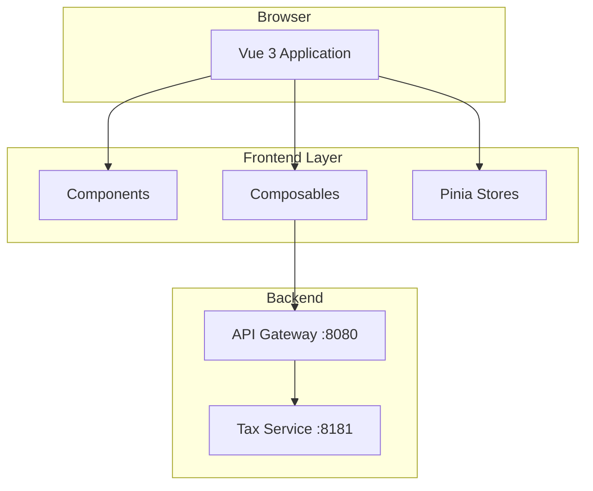
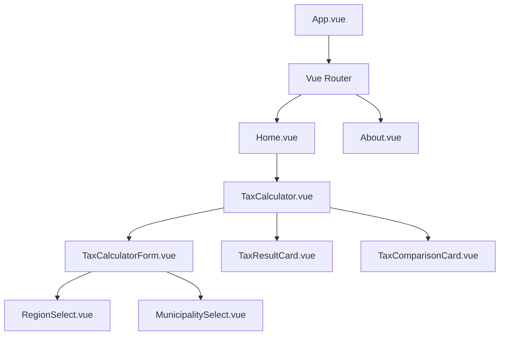
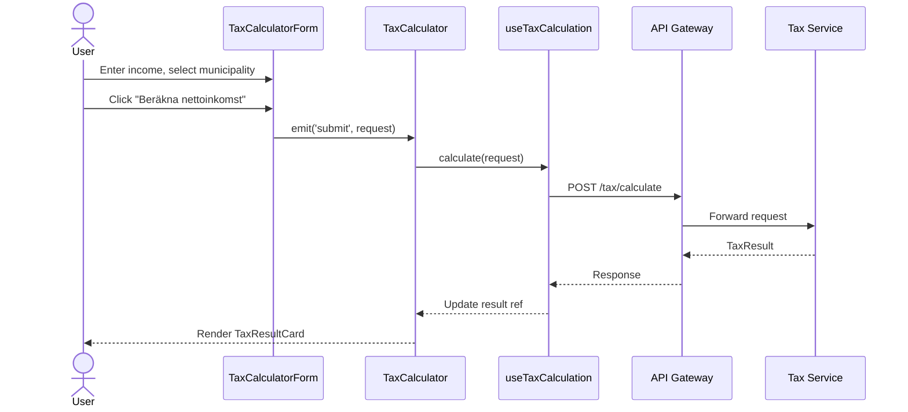
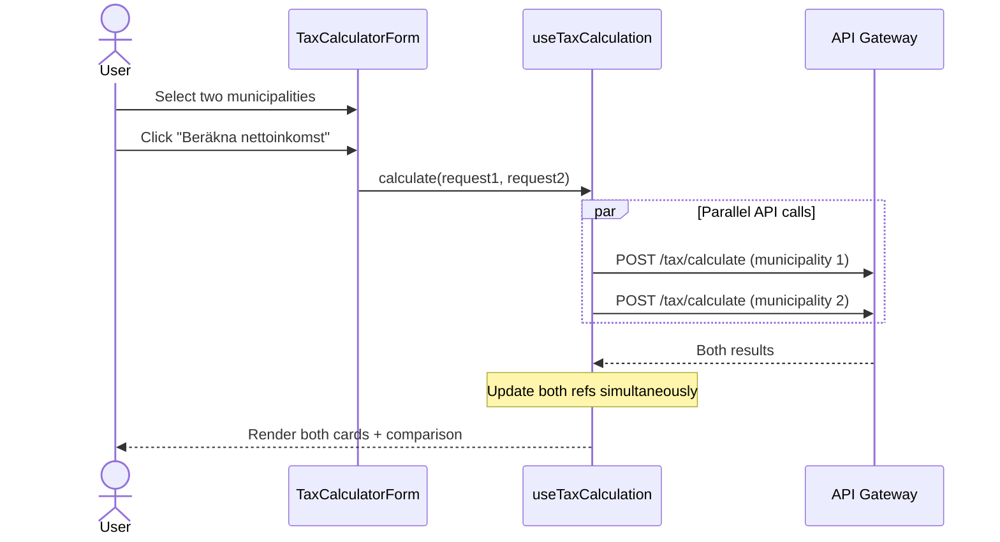
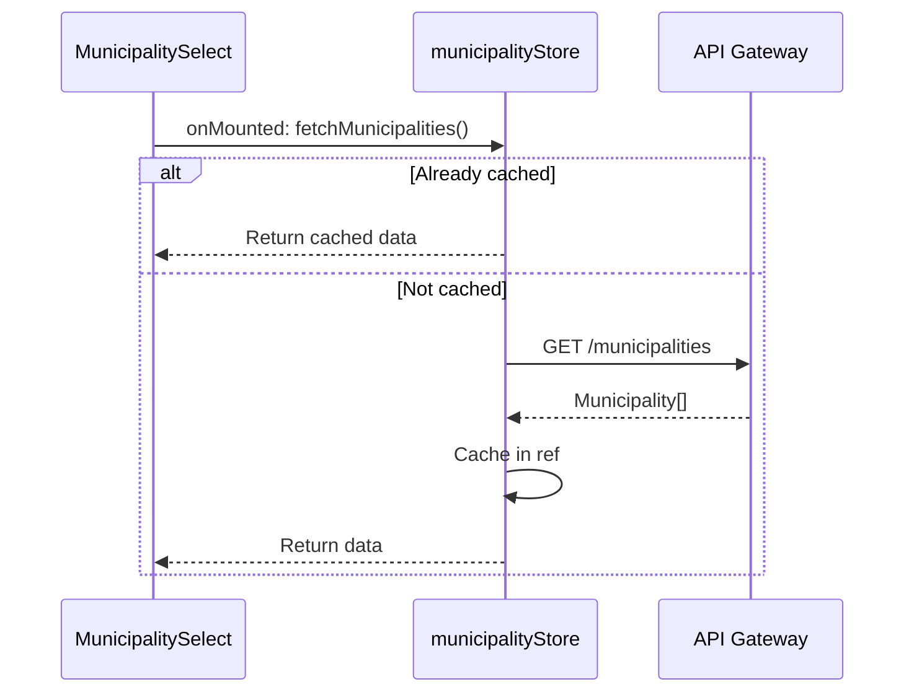
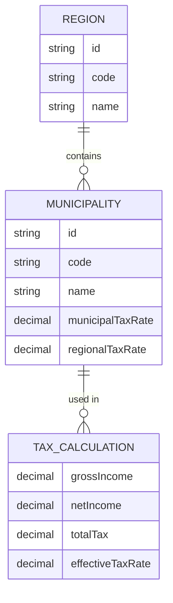

# NettoFrontend - System Overview

> **Purpose**: High-level system documentation focusing on architectural decisions and concepts  
> **Audience**: New team members, architects, and future maintainers  
> **Last Updated**: `2026-01-06`

---

## 1. System Overview

### What is NettoFrontend?

NettoFrontend is a Swedish net income calculator that helps users understand how much money they will receive after taxes. Users enter their gross monthly income and select a municipality to see a detailed breakdown of all tax components.

### Target Users

- **Swedish individuals** (employees and pensioners) wanting to understand their net income
- **Job seekers** comparing incomes across different municipalities
- **People considering relocation** who want to compare tax rates between municipalities

### Core Features

1. **Net Income Calculation** - Calculate monthly and yearly net income from gross income
2. **Municipality Selection** - Choose from all 290 Swedish municipalities
3. **Tax Breakdown** - See municipal tax, regional tax, state tax, fees, and deductions
4. **Compare Mode** - Compare net income between two municipalities side-by-side

### Business Value

- **Transparency**: Demystifies the Swedish tax system
- **Accuracy**: Uses official tax rates and SKV 433 calculation rules for 2026
- **Comparison**: Enables informed decisions about job offers and relocation

---

## 2. Architecture Overview

### High-Level Architecture



### Architectural Pattern

**Component-based architecture with Composition API**

The frontend follows Vue 3 best practices:
- **Components** handle UI rendering and user interaction
- **Composables** encapsulate reusable reactive logic and API calls
- **Stores** manage global state that needs to be shared across components

### Separation of Concerns

| Layer | Responsibility | Examples |
|-------|---------------|----------|
| **Views** | Page-level layout, routing | `Home.vue`, `About.vue` |
| **Components** | UI rendering, user interaction | `TaxCalculatorForm.vue`, `TaxResultCard.vue` |
| **Composables** | Business logic, API integration | `useTaxCalculation.ts`, `useFormValidation.ts` |
| **Stores** | Global state, caching | `municipalityStore.ts` |
| **Utils** | Pure functions, formatting | `formatters.ts` |
| **Types** | TypeScript interfaces | `tax.ts` |

---

## 3. Technology Stack

### Why These Choices?

| Technology | Choice | Rationale |
|------------|--------|-----------|
| **Framework** | Vue 3 | Composition API enables better code reuse, excellent TypeScript support |
| **Language** | TypeScript | Type safety, better IDE support, catches errors at compile time |
| **UI Library** | PrimeVue | Comprehensive component library, good accessibility, customizable themes |
| **State** | Pinia | Official Vue state management, simpler than Vuex, excellent TypeScript support |
| **Build** | Vite | Fast HMR, optimized production builds, native ES modules |
| **Routing** | Vue Router | Standard Vue routing solution, supports lazy loading |

### Trade-offs

**Vue 3 vs React**
- ✅ Simpler learning curve for the team
- ✅ Built-in reactivity system
- ❌ Smaller ecosystem than React

**PrimeVue vs Custom Components**
- ✅ Faster development with pre-built components
- ✅ Consistent styling and accessibility
- ❌ Bundle size, customization constraints

**Composition API vs Options API**
- ✅ Better code organization and reuse via composables
- ✅ Superior TypeScript integration
- ❌ Steeper learning curve for Vue 2 developers

**For specific versions:** See [package.json](../package.json)

---

## 4. Core Components

### Component Hierarchy



### Component Responsibilities

| Component | Responsibility |
|-----------|---------------|
| `TaxCalculator` | Orchestrates form, results, and comparison. Uses `useTaxCalculation` composable |
| `TaxCalculatorForm` | Collects user input (municipality, income, options). Handles validation |
| `TaxResultCard` | Displays calculation results (monthly or yearly view) |
| `TaxComparisonCard` | Shows difference between two municipality calculations |
| `RegionSelect` | Dropdown for filtering municipalities by region |
| `MunicipalitySelect` | Searchable autocomplete for selecting municipality |

### Key Composables

| Composable | Responsibility |
|------------|---------------|
| `useTaxCalculation` | Manages API calls, loading/error states, results |
| `useFormValidation` | Validates form inputs, provides error messages |

### Stores

| Store | Responsibility |
|-------|---------------|
| `municipalityStore` | Fetches and caches municipalities/regions, provides filtered lists |

---

## 5. Data Flow & Key Scenarios

### Tax Calculation Flow



### Compare Mode Flow

When user enables "Jämför med annan kommun":



**Design Decision**: Parallel requests via `Promise.all` ensure both results appear simultaneously, avoiding a "flickering" UI where one card appears before the other.

### Municipality Loading Flow



**Design Decision**: Municipalities are cached in Pinia store to avoid redundant API calls. The store fetches once and serves all components.

---

## 6. Domain Model

### Entity Relationships



### Key Domain Concepts

| Concept | Description |
|---------|-------------|
| **Region (Län)** | Sweden has 21 regions. Used for filtering municipalities |
| **Municipality (Kommun)** | Sweden has 290 municipalities, each with unique tax rates |
| **Gross Income (Bruttoinkomst)** | Income before taxes and deductions (employment, pension, etc.) |
| **Net Income (Nettoinkomst)** | Money received after all taxes |
| **Municipal Tax (Kommunalskatt)** | Tax paid to the municipality (~20-24%) |
| **Regional Tax (Regionskatt)** | Tax paid to the region (~10-12%) |
| **State Tax (Statlig skatt)** | Additional 20% tax on income above 643,000 kr/year |
| **Basic Deduction (Grundavdrag)** | Tax-free amount based on income level |
| **Job Tax Credit (Jobbskatteavdrag)** | Tax reduction for employment income |
| **Burial Fee (Begravningsavgift)** | Mandatory fee for everyone |
| **Church Fee (Kyrkoavgift)** | Only for Swedish Church members |

### Tax Calculation Formula (Conceptual)

```
Taxable Income = Gross Income - Basic Deduction
Municipal Tax = Taxable Income × Municipal Rate
Regional Tax = Taxable Income × Regional Rate
State Tax = (Taxable Income - Threshold) × 20%  [if applicable]
Total Tax = Municipal + Regional + State + Fees - Job Tax Credit
Net Income = Gross Income - Total Tax
```

**For exact calculation rules:** Backend implements SKV 433 (Skatteverket's technical specification for 2026)

---

## 7. API Integration

### Approach

All frontend API calls go through a centralized API Gateway on port 8080.

### Why API Gateway?

- **CORS Handling**: Gateway manages cross-origin requests from browser
- **Single Entry Point**: Frontend only needs to know one URL
- **Flexibility**: Backend services can be reorganized without frontend changes

### Endpoints Used

| Endpoint | Method | Purpose |
|----------|--------|---------|
| `/api/v1/regions` | GET | List all 21 Swedish regions |
| `/api/v1/municipalities` | GET | List all 290 municipalities with tax rates |
| `/api/v1/tax/calculate` | POST | Calculate net income for given input |

**For request/response formats:** See [frontend-integration-guide.md](frontend-integration-guide.md)

### Error Handling

| Status | Frontend Behavior |
|--------|------------------|
| `200` | Display results |
| `400` | Show validation errors from `messages[]` array |
| `404` | Show "Municipality not found" |
| `500` | Show generic error message |
| Network error | Show "Could not connect to server" |

---

## 8. Key Design Decisions

### 1. Composition API with Composables

**Decision**: Use Vue 3 Composition API with custom composables for all shared logic.

**Why**:
- Better TypeScript support than Options API
- Logic can be extracted and reused across components
- Clearer dependency tracking
- Easier to test in isolation

**Trade-off**: Steeper learning curve for developers familiar with Options API.

### 2. Pinia for State Management

**Decision**: Use Pinia instead of Vuex for global state.

**Why**:
- Simpler API (no mutations, just actions)
- First-class TypeScript support
- Official recommendation for Vue 3
- DevTools support

**Trade-off**: Smaller ecosystem of plugins compared to Vuex.

### 3. Municipality Caching in Store

**Decision**: Cache all municipalities in Pinia store after first fetch.

**Why**:
- Municipalities rarely change (yearly updates)
- Avoids redundant API calls
- Enables fast filtering and search

**Trade-off**: Initial load fetches all 290 municipalities (~50KB).

### 4. Parallel API Calls for Compare Mode

**Decision**: Use `Promise.all` to fetch both calculations simultaneously.

**Why**:
- Both results appear at the same time (no flickering UI)
- Faster total response time
- Better user experience

**Trade-off**: If one call fails, error handling is more complex.

### 5. InputText Instead of InputNumber

**Decision**: Use InputText with custom formatting for income input.

**Why**:
- InputNumber component had persistent styling issues
- Custom solution allows full control over formatting
- Thousand separators (Swedish format) work reliably

**Trade-off**: Manual implementation of numeric validation and formatting.

---

## 9. Known Limitations & Technical Debt

### Current Limitations

1. **No Authentication** - Calculator is fully public
2. **No Persistence** - Calculations are not saved
3. **Swedish Only** - No internationalization support
4. **Single Tax Year** - Hardcoded for 2026 tax rates

### Technical Debt

1. **Large Form Component** - `TaxCalculatorForm.vue` could be split into smaller components
2. **Duplicated Styling** - Some CSS is repeated across card components
3. **No Unit Tests** - Composables and utilities lack test coverage

### Planned Improvements

- [ ] Add unit tests for composables
- [ ] Extract shared card styling to CSS module
- [ ] Add loading skeletons for better perceived performance
- [ ] Consider SSR for SEO benefits

---

## 10. Glossary

### Domain Terms (Swedish)

| Swedish | English | Description |
|---------|---------|-------------|
| Bruttoinkomst | Gross income | Income before taxes (employment, pension, etc.) |
| Nettoinkomst | Net income | Income after taxes |
| Kommun | Municipality | Local government unit (290 in Sweden) |
| Län / Region | Region | Regional government unit (21 in Sweden) |
| Kommunalskatt | Municipal tax | Tax paid to municipality |
| Regionskatt | Regional tax | Tax paid to region |
| Statlig skatt | State tax | National income tax on high earners |
| Grundavdrag | Basic deduction | Tax-free amount |
| Jobbskatteavdrag | Job tax credit | Tax reduction for employment |
| Begravningsavgift | Burial fee | Mandatory fee |
| Kyrkoavgift | Church fee | Fee for Swedish Church members |
| SKV 433 | - | Skatteverket's technical tax calculation specification |

### Technical Terms

| Term | Description |
|------|-------------|
| Composable | Reusable function using Vue's Composition API |
| Pinia Store | Global state container |
| API Gateway | Backend proxy handling routing and CORS |
| HMR | Hot Module Replacement (Vite feature) |

---

## Changelog

| Date | Change | Author |
|------|--------|--------|
| 2026-01-06 | Initial system overview created | AI/CarlssonOscar |

---

**For implementation details:** See source code  
**For API specifics:** See [frontend-integration-guide.md](frontend-integration-guide.md)  
**For code standards:** See [.github/code-standards.md](../.github/code-standards.md)
